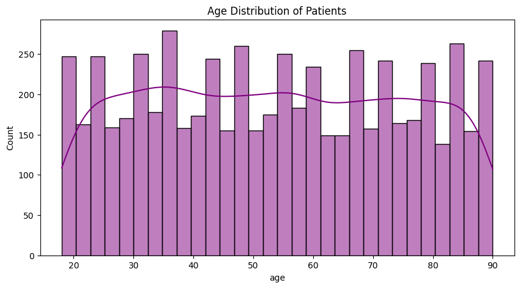
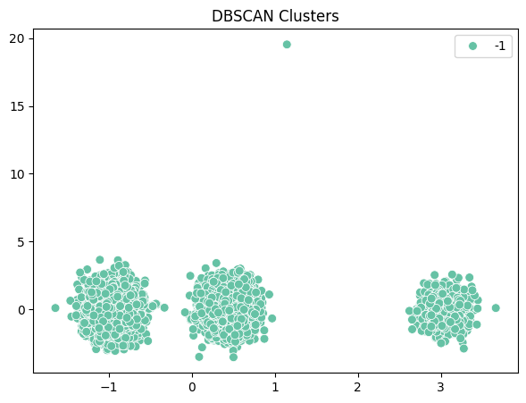

# 🩺 Patient Clustering App

This project provides an **interactive Streamlit web application** for clustering patient datasets using multiple algorithms.  
The system automatically evaluates and selects the **best clustering method** to group patients based on their features.

---

## 📖 Introduction
Healthcare data contains valuable information such as demographics, medical history, and diagnostic results.  
Clustering helps in uncovering hidden patterns by grouping similar patients, which can be applied for:
- Early disease detection  
- Personalized treatment strategies  
- Outlier and anomaly detection  
- Research and predictive healthcare analytics  

This application enables automatic preprocessing, clustering, evaluation, and visualization of patient datasets.

---

## ✅ Tasks Performed
1. **Data Preprocessing**
   - Handle missing values (numeric → median, categorical → mode).  
   - Encode categorical features using One-Hot Encoding.  
   - Normalize features using StandardScaler.  

2. **📊 Visualization Plots**

   ### Histogram
   Shows Relationships.  
   

   ### Correlation Heatmap
   Highlights feature relationships.  
   

   ### Hierarchical Dendrogram
   Displays hierarchical grouping of patients.  
   

3. **Clustering Algorithms**
   - **KMeans**  
   - **Hierarchical (Agglomerative)**  
   - **DBSCAN** 

4. **Evaluation Metrics**
   - Silhouette Score  
   - Calinski-Harabasz Index  
   - Davies-Bouldin Score  
   - RI  
   - Dunn Index  
   - Elbow Model  

   ### 📌 Results Table  

   Best clustering method based on **Silhouette Score**: **Hierarchical**  

   | Algorithm     | Silhouette | Calinski-Harabasz | Davies-Bouldin | RI   | Dunn Index | Elbow Model |
   |---------------|------------|-------------------|----------------|------|------------|-------------|
   | **KMeans**    | 0.07136    | 374.864184        | 3.218522       | -1   | 0.027772   | [101543.67, 95998.53, 93745...] |
   | **Hierarchical** | 0.168851   | 391.621526        | 1.373171       | -1.0 | 0.371566   | -1.0        |
   | **DBSCAN**    | -1         | -1                | -1             | -1   | -1         | -1          |

5. **Best Model Selection**
   - Algorithm with the best Silhouette Score is automatically chosen.  

---

## 📌 Cluster Visualization Examples  

### KMeans Clusters  

### Hierarchical Clusters  

### DBSCAN Clusters  

---

## 📝 Conclusion
- **KMeans** provides stable and balanced clusters, suitable for general patient grouping.  
- **Hierarchical Clustering** reveals deeper subgroup relationships.  
- **DBSCAN** effectively detects noise and anomalies but may produce fewer valid clusters.  
- Automating evaluation ensures that the **best algorithm is always selected** for the given dataset.  

This tool is valuable for **healthcare professionals, researchers, and analysts** to explore patient data and discover meaningful patterns.  # PATIENT-DATASET-FOR-CLUSTERING
